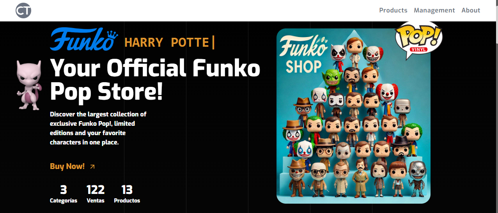

  
  

# Funko Pop Store and Management System

### Developed by Joaquín Cleva

## Project Description

The **Funko Pop Management System** is a web application developed with **React** and **Next** and styled using **Tailwind**. Its purpose is to provide an interactive platform for exploring, managing, and simulating the purchase of Funko Pop figures. The application offers user-friendly features for managing Funko Pop collections, complete with a responsive design and seamless navigation.

### Key Features
- **Interactive Visualization:** Explore a wide variety of Funko Pop figures with detailed information and interactive displays.  
- **Payment Simulation:** Simulate the purchase process of Funko Pop figures, including cart and checkout functionalities.  
- **Management Page:** Add, edit, or delete Funko Pop entries in a dedicated management interface.  
- **Responsive Design:** Ensure a seamless user experience across devices with the integration of Tailwind.  

---

Enjoy managing your Funko Pop collection with this dynamic and intuitive React application!